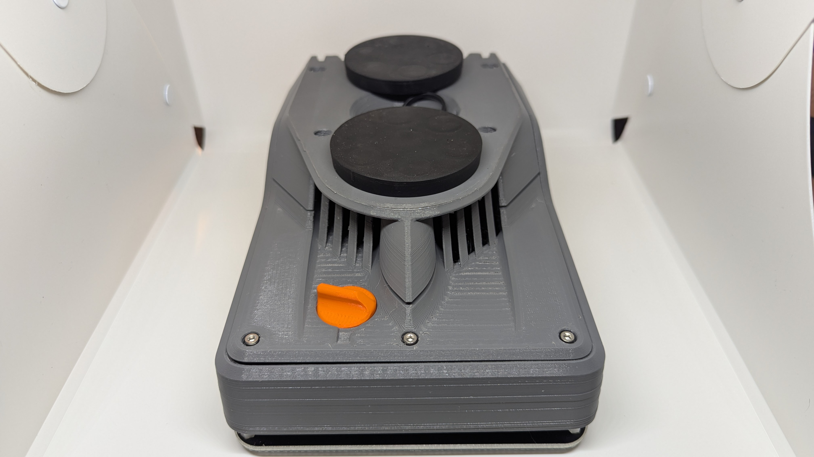
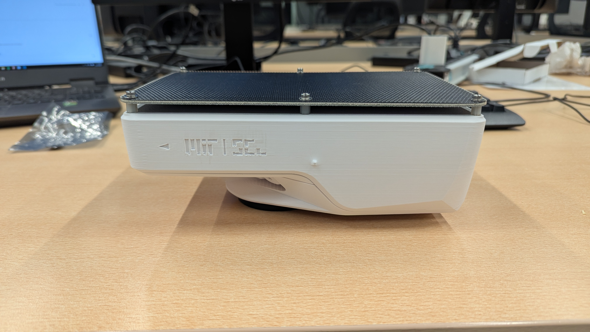
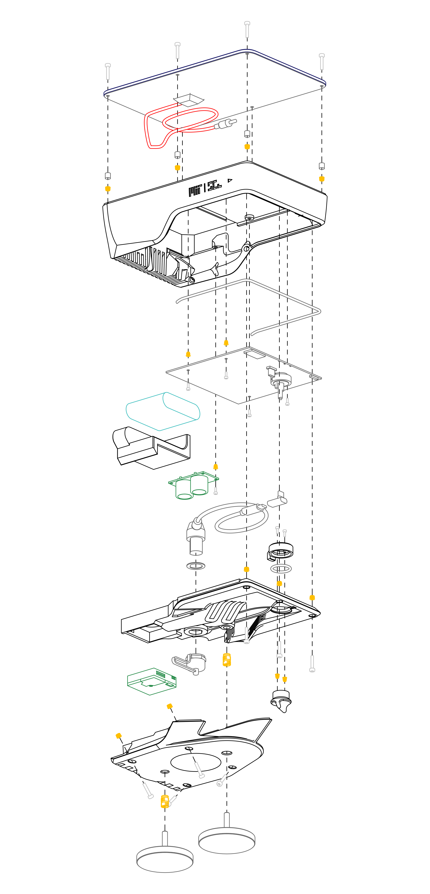

<h1>Flatburn-LTE deployment Rijksuniversiteit Groningen</h1>

A visual overview of the Flatburn-LTE system as deployed at the Rijksuniversiteit Groningen.

## At a glance
| Item | Detail |
| --- | --- |
| Deployment site | Rijksuniversiteit Groningen |
| System role | [ Mobile Air Quality Sensing Network ] |
| Enclosure | [ PETG / ASA ] |
| Power | [Battery / mains / solar] |
| Status | [ Prototype ] |
| Last updated | 2026-02-16 |

## System overview

## Module gallery
<table>
  <tr>
    <td align="center">
      
       
      Module 1 - [Name]
    </td>
    <td align="center">
      
       
      Module 2 - [Name]
    </td>
  </tr>
</table>

## Exploded views
<table>
  <tr>
    <td align="center">
      
       
      Exploded view - [Enclosure / stack]
    </td>
  </tr>
</table>

## Architecture snapshot
Add a block diagram at `assets/architecture-block-diagram.png`, then uncomment the line below.
<!--  -->

2-3 sentences describing the signal flow and data path from sensors to LTE backhaul.

## Repository map
- `hardware/` Hardware design files, CAD, and BOMs.
- `firmware/` Embedded firmware sources and build notes.
- `Version_22_1/` Reference release snapshot for the deployment.
- `assets/` Image assets for this overview page.

## How to update images
1. Drop images into `assets/`, `assets/modules/`, or `assets/exploded/`.
1. Update the filenames in this README to match your assets.
1. Keep a consistent crop ratio and background for a cohesive gallery.
